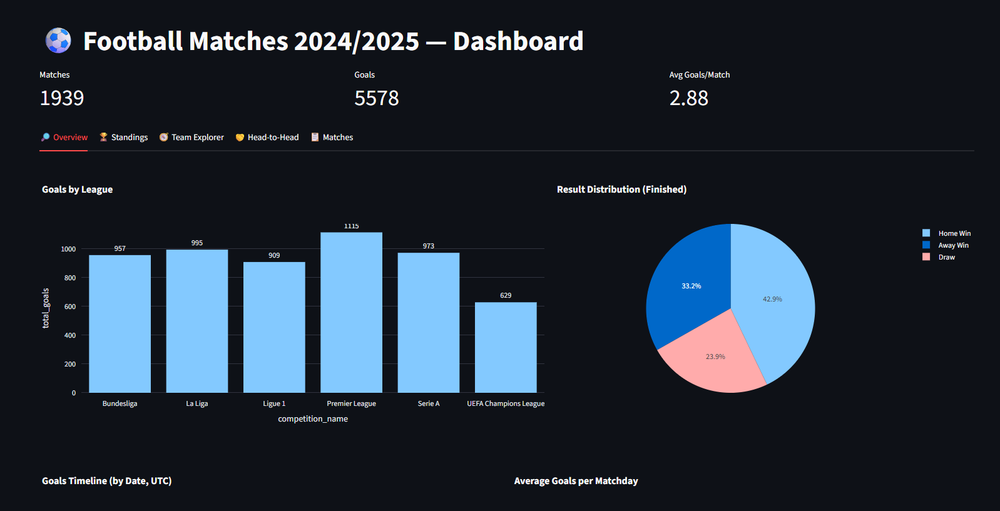
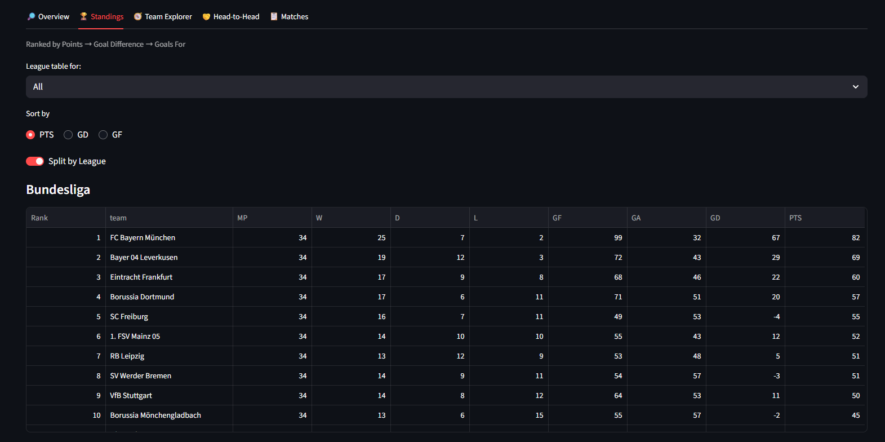
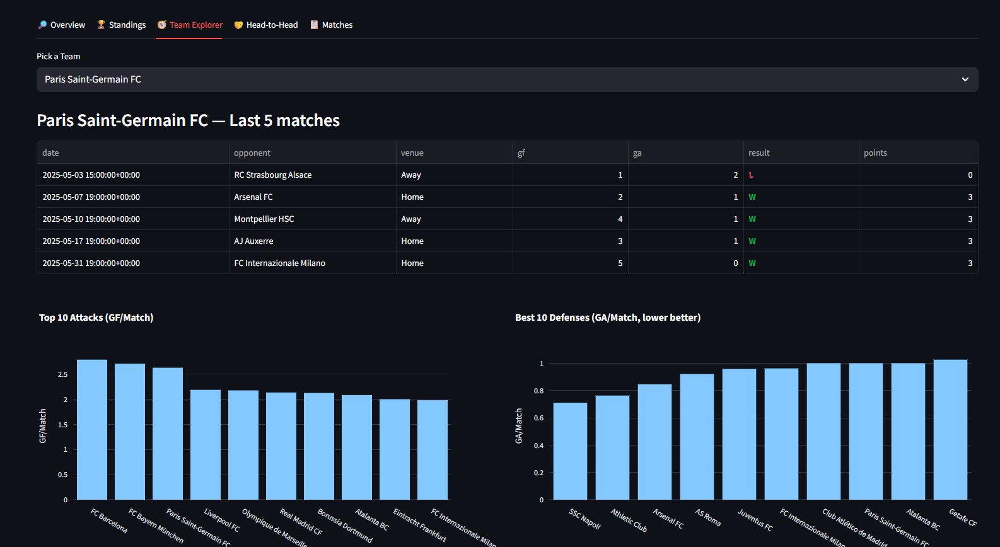
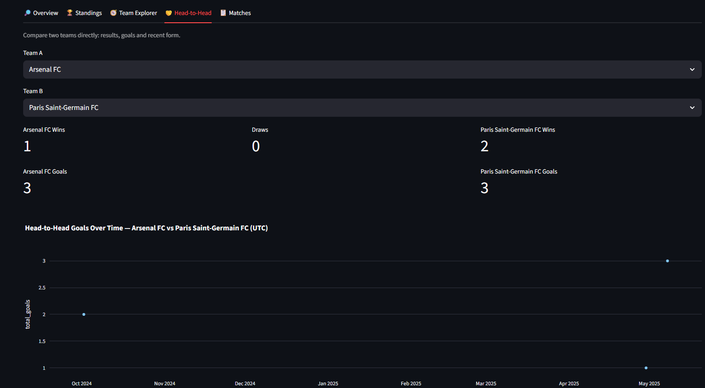
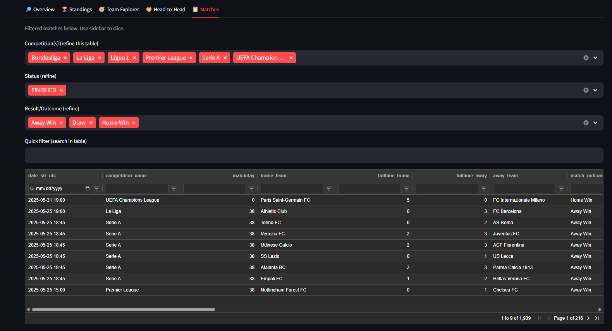

# ⚽ Football Matches 2024/2025 Dashboard

[](https://streamlit.io/)\
[](https://github.com/tarekmasryo)

------------------------------------------------------------------------

## 🎥 Live Preview


------------------------------------------------------------------------

## 📌 Overview

Interactive dashboard built with **Streamlit, Plotly, and Ag-Grid** to
explore the\
[Football Matches 2024/2025
Dataset](https://github.com/tarekmasryo/Football-Matches-Results-2024-2025-season/blob/main/data/football_matches_2024_2025.csv).

-   🏟️ 1,900+ matches from Premier League, La Liga, Serie A, Bundesliga,
    Ligue 1, and UEFA Champions League\
-   ⚽ KPIs: matches, goals, average goals per match\
-   📊 Standings auto-calculated (PTS → GD → GF)\
-   🔎 Filters by league, team, stage, match status, and date range\
-   🤝 Head-to-Head explorer for any two clubs

------------------------------------------------------------------------

## 📊 Dashboard Preview

### Overview (KPIs + Charts)



### Standings Table



### Team Explorer



### Head-to-Head



### Matches Table (Ag-Grid)



------------------------------------------------------------------------

## 🔑 Features

-   **Filters**: league, stage, match status, team, date range\
-   **KPIs**: matches, total goals, avg goals per match\
-   **Visuals**: bar charts, pie charts, timelines, histograms\
-   **Standings**: auto-ranked by Points, GD, GF\
-   **Team Explorer**: last 5 matches, attack & defense rankings\
-   **Head-to-Head**: compare two clubs (results, goals, timeline)\
-   **Ag-Grid Table**: sortable, filterable, downloadable

------------------------------------------------------------------------

## 🚀 Run Locally

Clone the repo and install requirements:

``` bash
git clone https://github.com/tarekmasryo/Football-Matches-Results-2024-2025-season.git
cd Football-Matches-Results-2024-2025-season
pip install -r requirements.txt
```

Run the app:

``` bash
streamlit run app.py
```

------------------------------------------------------------------------

## ☁️ Deploy on Streamlit Cloud

You can deploy directly to [Streamlit
Cloud](https://streamlit.io/cloud).\
Make sure your **data source** points to the RAW CSV:

``` toml
# .streamlit/secrets.toml
DATA_URL = "https://raw.githubusercontent.com/tarekmasryo/Football-Matches-Results-2024-2025-season/main/data/football_matches_2024_2025.csv"
```


------------------------------------------------------------------------

## Related Repositories
- 📂 [Football Matches Dataset](https://github.com/tarekmasryo/football-matches-dataset)
- 🔍 [Football Matches EDA](https://github.com/tarekmasryo/football-matches-eda)


If you use this dashboard or dataset, please credit as:

> Football Matches 2024/2025 Dashboard and Dataset by **Tarek Masryo**.\
> Code licensed under Apache 2.0 . Data licensed under CC BY-NC 4.0.
